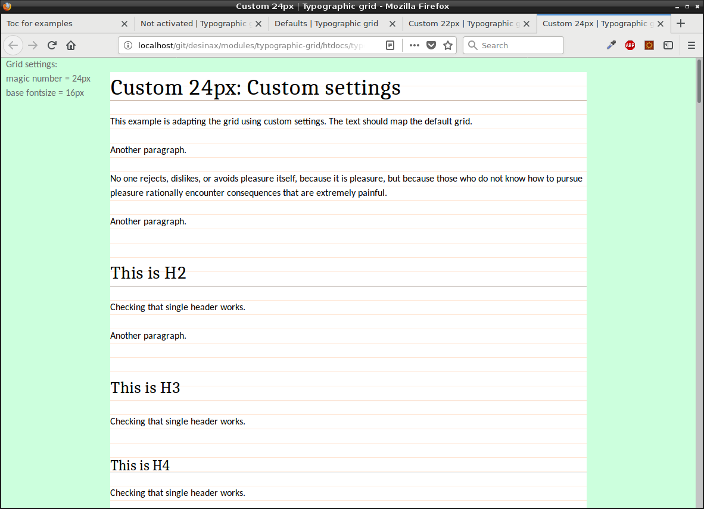

Desinax Typographic Grid (LESS)
===============================

[](https://badge.fury.io/js/%40desinax%2Ftypographic-grid)
[](https://gitter.im/desinax/typographic-grid?utm_source=badge&utm_medium=badge&utm_campaign=pr-badge&utm_content=badge)

[](https://travis-ci.org/desinax/typographic-grid)
[](https://circleci.com/gh/desinax/typographic-grid)

LESS module implementing a typographic grid. This is also knows as a horizontal grid, a baseline grid, used to create vertical rythm in a layout.




Table of content
-------------------------------

* [Documentation online](#documentation-online)
* [Install](#install)
* [About grid.less](#about-gridless)
* [Configure grid.less](#configure-gridless)
* [Using grid.less](#using-gridless)
    * [Prepare with HTML](#prepare-with-html)
    * [Style the row](#style-the-row)
    * [Style the columns](#style-the-columns)
    * [Grid wrapper](#grid-wrapper)
    * [Responsive grid](#responsive-grid)
    * [Show the grid](#show-the-grid)
    * [Avoid styling the grid row or grid column](#avoid-styling-the-grid-row-or-grid-column)
* [More examples on usage](#more-examples-on-usage)
* [History](#history)
* [License](#license)


Documentation online
-------------------------------

You can read this README and try out the example files `htdocs/*.html` by using GitHub Pages.

* [GitHub Pages README](https://desinax.github.io/typografic-grid/).
* [GitHub Pages examples in htdocs/](https://desinax.github.io/typografic-grid/htdocs).

Viewing this documentation on GitHub Pages makes it easier to both read this documentation and try out the examples on the same time.


Install
-------------------------------

You can install using npm to take advantage of version management. Semantic versioning is used to label the various versions.

```text
npm install @desinax/typographic-grid
```

Or clone this repo and use it as is.


About typography.less
-------------------------------

The quick way to import all parts of the typographic grid is to import the file [`typography.less`](src/less/typography.less), like this.

```less
/**
 * Import the typographic grid.
 */
@import "src/less/typography.less";
```

That is a shortcut for importing all the parts of the module. You can also import all parts like this.

```less
/**
 * Import the parts making up the typographic grid.
 */
@import "src/less/typography-font-families.less";
@import "src/less/typography-sizes.less";
@import "src/less/typography-mixins.less";
@import "src/less/typography-defaults.less";
```

These are the files making up the module.

Lets review these files, one by one, and see what can be configured when using them.


About typography-font-families.less
-------------------------------

This file contains a set of font families stored in variables. It also contains a selection of default font families to use for headers, body and code. You can review the file in [`src/less/typography-font-families.less`](src/less/typography-font-families.less).

The file contains some definitions of common font families, like this.

```less
// Monospace
@fontFamilyCourier:         "Courier New", Courier, monospace;

// Serif
@fontFamilyCambria:         Cambria, Georgia, Times, 'Times New Roman', serif;

// Sans-serif
@fontFamilyVerdana:         Verdana, Geneva, sans-serif;
```

If we only look at this file we could import it like this and add our own configurations of the default fonts.

```less
/**
 * Import the parts making up the typographic grid.
 */
@import "src/less/typography-font-families.less";

// Set font family to use
@fontFamilyHeadings:  @fontFamilyCambria;
@fontFamilyBody:      @fontFamilyCalibri;
@fontFamilyCode:      @fontFamilyCourier;
```


About typography-sizes.less
-------------------------------

This file contains he calculations of the font size to use for various elements. You can review the file in [`src/less/typography-sizes.less`](src/less/typography-sizes.less).

If we just look at the content of the file we see variables with som appearingly random sizes. But it so much more to it, than meets the eye.

Lets look at the content of the file.

```less
/**
 * Typographic sizes to create vertical rythm using a magic number as base.
 */
@magicNumber:    24px; /* 16px - 100%/1.5 */
//@magicNumber:    22px; /* 16px - 100%/1.375 */
@fontSizeBody:   16px;
@lineHeightBase: ( unit(@magicNumber) / unit(@fontSizeBody) );

// font size headers
@fontSizeH1: 2.375em;
@fontSizeH2: 1.875em;
@fontSizeH3: 1.375em;
@fontSizeH4: 1.25em;
@fontSizeH5: 1em;
@fontSizeH6: 0.875em;

// fontsize code blocks
@fontSizeCodeInline:  1.25em;
@fontSizeCodeBlock:   1.25em;
@lineHeightCodeBlock: 1.6;

// fontsize super and subscripts
@fontSizeSupSub: 0.75em;

// fontsize smaller
@fontSizeSmall: 0.875em;
```

The magic number `@magicNumber` is set to 24px. The standard fontsize is set to `16px`. The line-height is then calculated (24/16) to be 1.5 for this setup.

The idea is that all fonts should have a fontsize and a line-height that fits in a multiple of the magic number. So, this is true for the above setup since fontsize x line-height is 24 (16*1.5).


License
-------------------------------

The license is MIT, review it in [LICENSE](LICENSE).


```
 . 
..:  Copyright (c) 2016-2018 Mikael Roos, mos@dbwebb.se 
```
